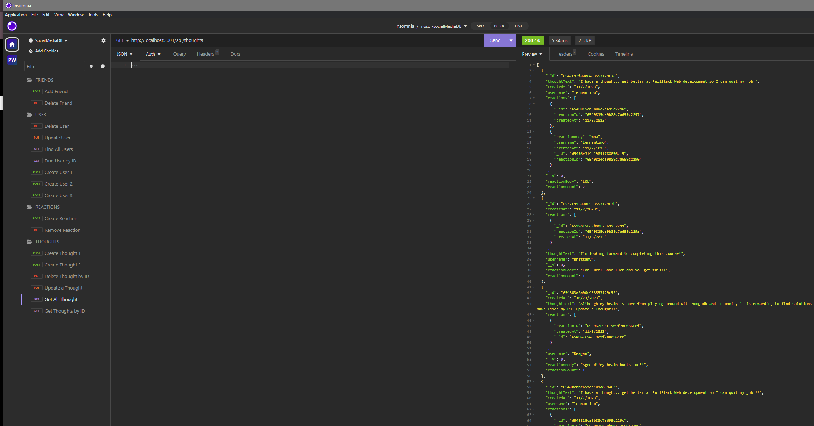
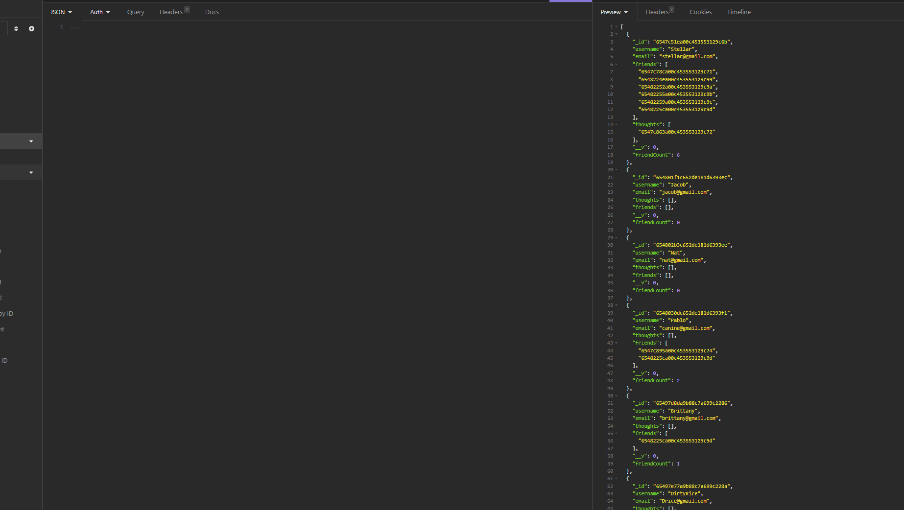

#  NOSql Social Network-API


# Description
This challenge is to build a back-end API for a social network web application. Users can create their thoughts, create a friends list and react to friends' thoughts. This app uses Express.js for routing, Mongoose ODM and MongDB database to hold data.

## Table of Contents
* [Installation](#installation)
* [Usage](#usage)
* [License](#license)
* [Contributing](#contributing)
* [Tests](#tests)
* [Questions](#questions)

## Installation
### The following dependencies required to run the application:
* [express.js](https://www.npmjs.com/package/express)

* [Insomnia REST](https://insomnia.rest/products/insomnia)

* [Sequelize](https://www.npmjs.com/package/sequelize)

* [NodeJS](https://nodejs.org/en/download)

* [Nodemon](https://www.npmjs.com/package/nodemon)

* [dotenv](https://www.npmjs.com/package/dotenv)

* [MongoDB Compass](https://www.mongodb.com/products/tools/compass)

* [Mongoosejs](https://mongoosejs.com/)


## Usage
### Screenshot

Thought API

Users API


### Walkthrough Video
[Demonstration Video](https://drive.google.com/file/d/1FUP8le3zC8iXShvWUefCn6ML-aEcLdFL/view)
## License


## Contributing:
UCF Bootcamp Student Support


## Tests
```bash
node server.js
```


## Questions
This project was created by Kevin Rice; for additional questions, reach out to me at the following below:
* Author: [Kevin Rice](https://app.slack.com/client/T056YAJ4MPF/D05D0V54751)
* GitHub: [DirtyRice901](https://github.com/DirtyRice901/)
* Email: reatriniti@gmail.com 

---
© 2023 edX Boot Camps LLC. Confidential and Proprietary. All Rights Reserved.